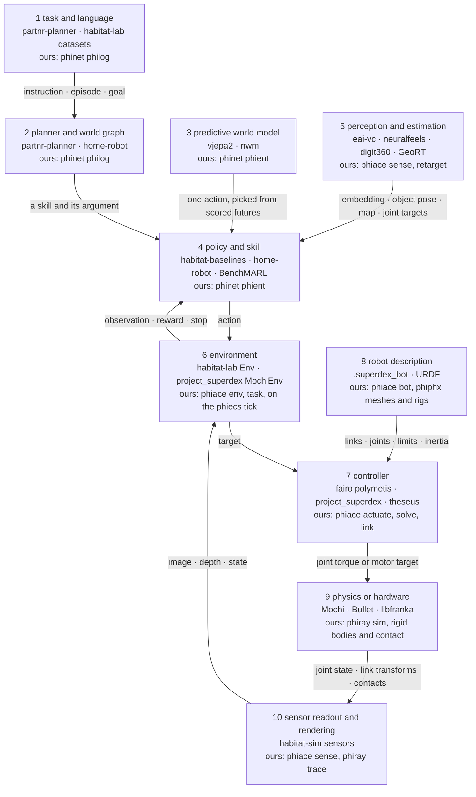
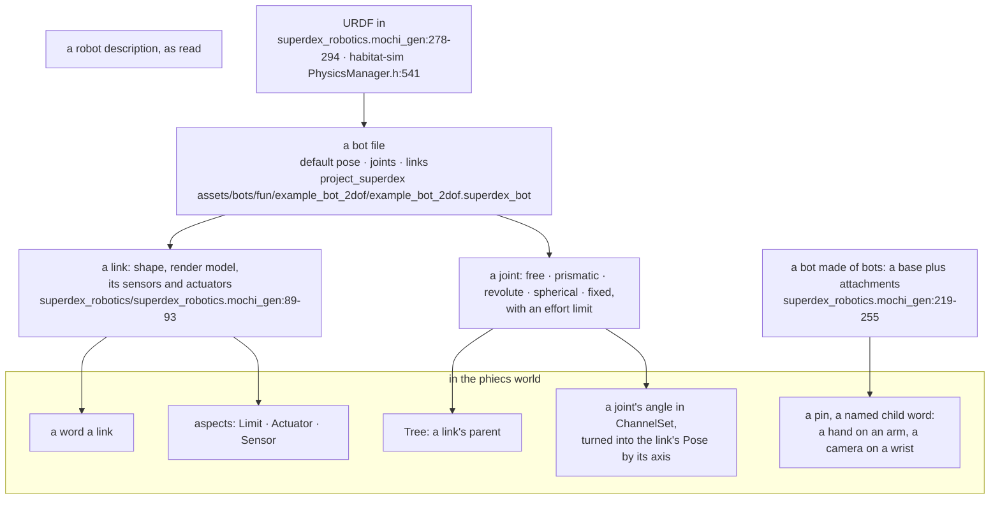
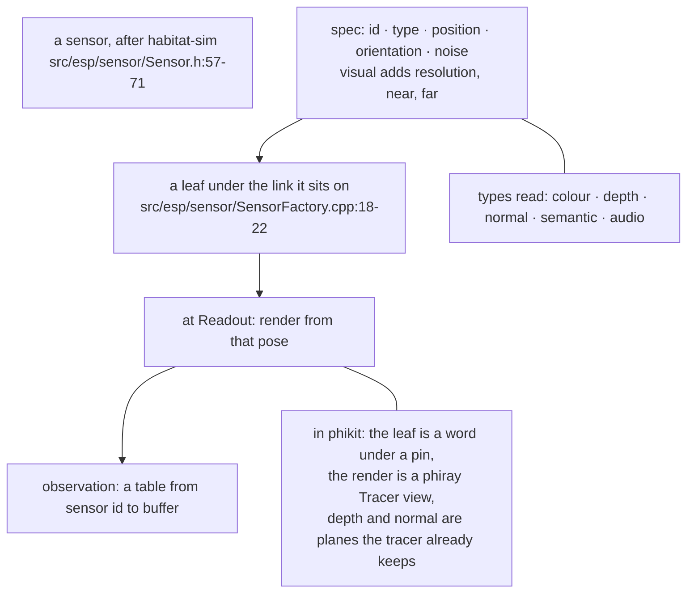

# layer

The stack as Meta's repositories divide it, top to bottom, with what
crosses each boundary and the crate that holds or will hold the layer.

```mermaid
graph TB
    l1["1 task and language<br/>partnr-planner · habitat-lab datasets<br/>ours: phinet philog"]
    l2["2 planner and world graph<br/>partnr-planner · home-robot<br/>ours: phinet philog"]
    l3["3 predictive world model<br/>vjepa2 · nwm<br/>ours: phinet phient"]
    l4["4 policy and skill<br/>habitat-baselines · home-robot · BenchMARL<br/>ours: phinet phient"]
    l5["5 perception and estimation<br/>eai-vc · neuralfeels · digit360 · GeoRT<br/>ours: phiace sense, retarget"]
    l6["6 environment<br/>habitat-lab Env · project_superdex MochiEnv<br/>ours: phiace env, task, on the phiecs tick"]
    l7["7 controller<br/>fairo polymetis · project_superdex · theseus<br/>ours: phiace actuate, solve, link"]
    l8["8 robot description<br/>.superdex_bot · URDF<br/>ours: phiace bot, phiphx meshes and rigs"]
    l9["9 physics or hardware<br/>Mochi · Bullet · libfranka<br/>ours: phiray sim, rigid bodies and contact"]
    l10["10 sensor readout and rendering<br/>habitat-sim sensors<br/>ours: phiace sense, phiray trace"]
    l1 -->|"instruction · episode · goal"| l2
    l2 -->|"a skill and its argument"| l4
    l3 -->|"one action, picked from scored futures"| l4
    l5 -->|"embedding · object pose · map · joint targets"| l4
    l4 -->|"action"| l6
    l6 -->|"target"| l7
    l8 -->|"links · joints · limits · inertia"| l7
    l7 -->|"joint torque or motor target"| l9
    l9 -->|"joint state · link transforms · contacts"| l10
    l10 -->|"image · depth · state"| l6
    l6 -->|"observation · reward · stop"| l4
```

```mermaid
graph TB
    key["a robot description, as read"]
    b_file["a bot file<br/>default pose · joints · links<br/>project_superdex assets/bots/fun/example_bot_2dof/example_bot_2dof.superdex_bot"]
    b_link["a link: shape, render model,<br/>its sensors and actuators<br/>superdex_robotics/superdex_robotics.mochi_gen:89-93"]
    b_joint["a joint: free · prismatic · revolute · spherical · fixed,<br/>with an effort limit"]
    b_mod["a bot made of bots: a base plus attachments<br/>superdex_robotics.mochi_gen:219-255"]
    b_urdf["URDF in<br/>superdex_robotics.mochi_gen:278-294 · habitat-sim PhysicsManager.h:541"]
    subgraph ecs["in the phiecs world"]
        e_word["a word a link"]
        e_tree["Tree: a link's parent"]
        e_rig["a joint's angle in ChannelSet,<br/>turned into the link's Pose by its axis"]
        e_pin["a pin, a named child word:<br/>a hand on an arm, a camera on a wrist"]
        e_asp["aspects: Limit · Actuator · Sensor"]
    end
    b_file --> b_link --> e_word
    b_file --> b_joint --> e_tree
    b_joint --> e_rig
    b_mod --> e_pin
    b_urdf --> b_file
    b_link --> e_asp
```

```mermaid
graph TB
    key["a sensor, after habitat-sim src/esp/sensor/Sensor.h:57-71"]
    s_spec["spec: id · type · position · orientation · noise<br/>visual adds resolution, near, far"]
    s_node["a leaf under the link it sits on<br/>src/esp/sensor/SensorFactory.cpp:18-22"]
    s_draw["at Readout: render from that pose"]
    s_obs["observation: a table from sensor id to buffer"]
    s_kinds["types read: colour · depth · normal · semantic · audio"]
    s_spec --> s_node --> s_draw --> s_obs
    s_spec --- s_kinds
    ours["in phikit: the leaf is a word under a pin,<br/>the render is a phiray Tracer view,<br/>depth and normal are planes the tracer already keeps"]
    s_draw --- ours
```
