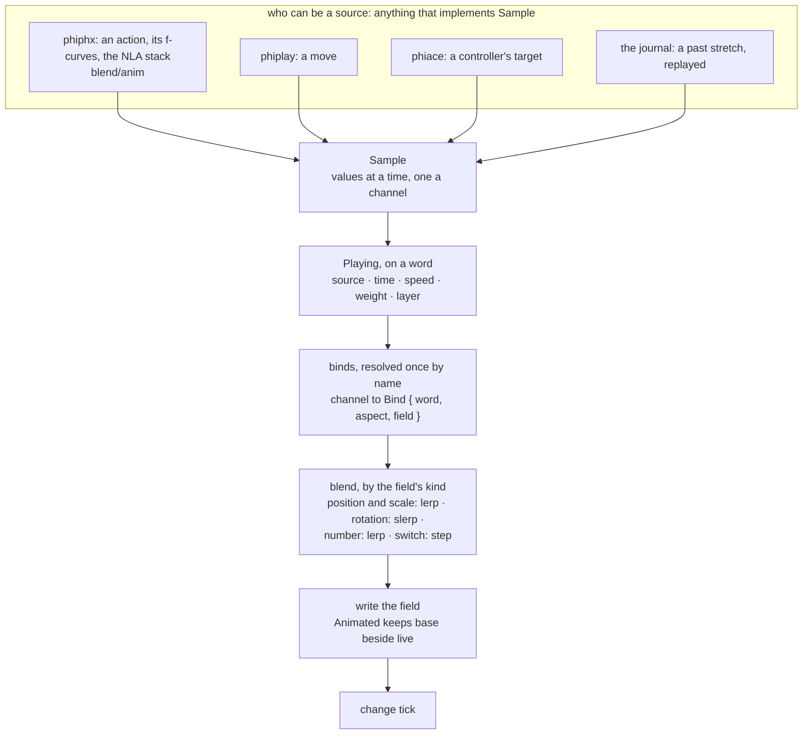
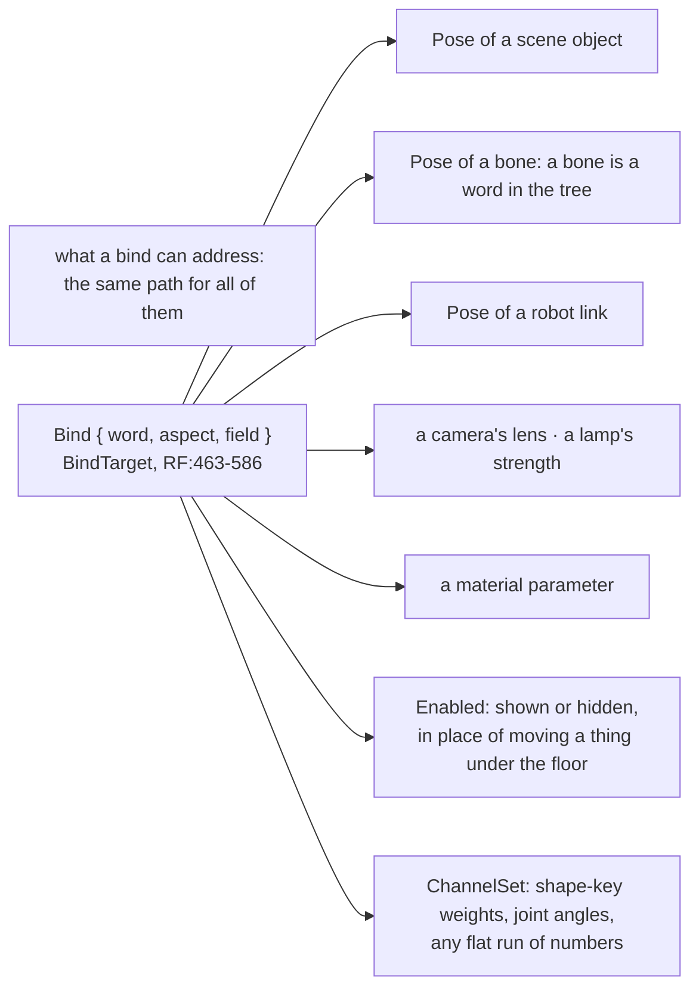
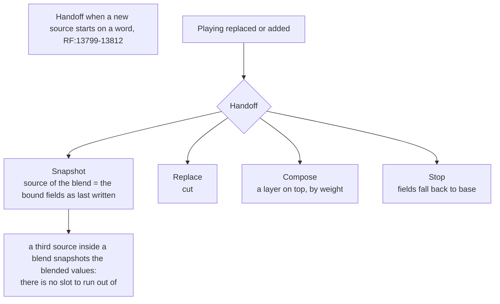
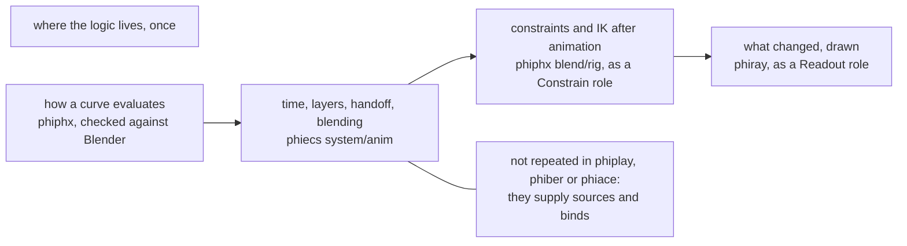

# anim

Every box is to build. One path animates any field of any aspect of any
word; nothing on it knows what a bone is.

```mermaid
graph TB
    subgraph sources["who can be a source: anything that implements Sample"]
        s_clip["phiphx: an action, its f-curves, the NLA stack<br/>blend/anim"]
        s_move["phiplay: a move"]
        s_target["phiace: a controller's target"]
        s_tape["the journal: a past stretch, replayed"]
    end
    a_sample["Sample<br/>values at a time, one a channel"]
    a_play["Playing, on a word<br/>source · time · speed · weight · layer"]
    a_bind["binds, resolved once by name<br/>channel to Bind { word, aspect, field }"]
    a_blend["blend, by the field's kind<br/>position and scale: lerp · rotation: slerp ·<br/>number: lerp · switch: step"]
    a_write["write the field<br/>Animated keeps base beside live"]
    a_tick["change tick"]
    s_clip --> a_sample
    s_move --> a_sample
    s_target --> a_sample
    s_tape --> a_sample
    a_sample --> a_play --> a_bind --> a_blend --> a_write --> a_tick
```

```mermaid
graph LR
    key["what a bind can address: the same path for all of them"]
    b_pose["Pose of a scene object"]
    b_bone["Pose of a bone: a bone is a word in the tree"]
    b_link["Pose of a robot link"]
    b_cam["a camera's lens · a lamp's strength"]
    b_mat["a material parameter"]
    b_on["Enabled: shown or hidden,<br/>in place of moving a thing under the floor"]
    b_chan["ChannelSet: shape-key weights, joint angles,<br/>any flat run of numbers"]
    b_bind["Bind { word, aspect, field }<br/>BindTarget, RF:463-586"]
    b_bind --> b_pose
    b_bind --> b_bone
    b_bind --> b_link
    b_bind --> b_cam
    b_bind --> b_mat
    b_bind --> b_on
    b_bind --> b_chan
```

```mermaid
graph TB
    key["Handoff when a new source starts on a word, RF:13799-13812"]
    h_new["Playing replaced or added"]
    h_kind{"Handoff"}
    h_snap["Snapshot<br/>source of the blend = the bound fields as last written"]
    h_rep["Replace<br/>cut"]
    h_comp["Compose<br/>a layer on top, by weight"]
    h_stop["Stop<br/>fields fall back to base"]
    h_chain["a third source inside a blend snapshots the blended values:<br/>there is no slot to run out of"]
    h_new --> h_kind
    h_kind --> h_snap --> h_chain
    h_kind --> h_rep
    h_kind --> h_comp
    h_kind --> h_stop
```

```mermaid
graph LR
    key["where the logic lives, once"]
    w_curve["how a curve evaluates<br/>phiphx, checked against Blender"]
    w_play["time, layers, handoff, blending<br/>phiecs system/anim"]
    w_solve["constraints and IK after animation<br/>phiphx blend/rig, as a Constrain role"]
    w_draw["what changed, drawn<br/>phiray, as a Readout role"]
    w_curve --> w_play --> w_solve --> w_draw
    w_no["not repeated in phiplay, phiber or phiace:<br/>they supply sources and binds"]
    w_play --- w_no
```
