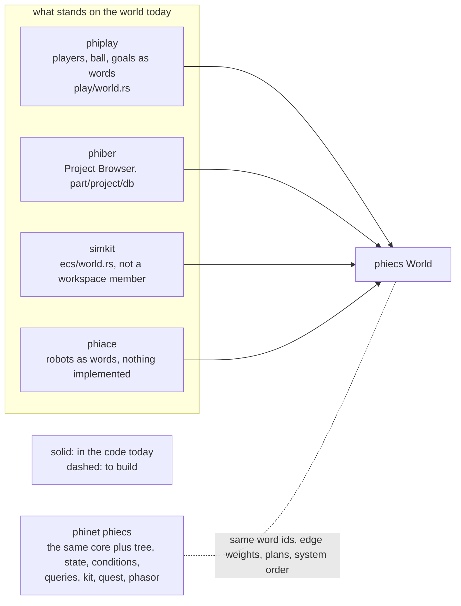
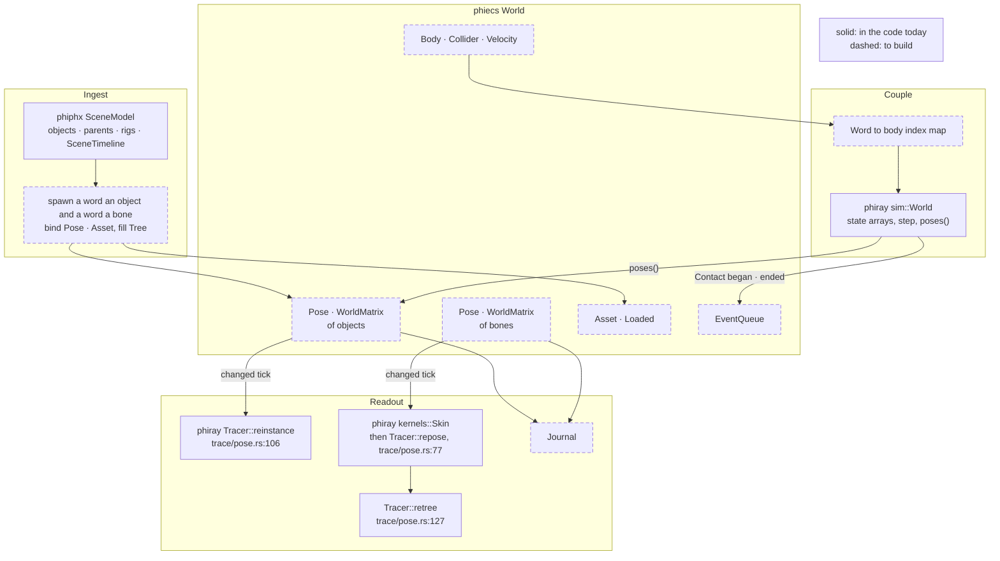
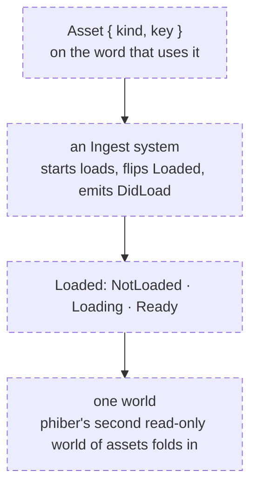

# bridge

```mermaid
graph LR
    key["solid: in the code today<br/>dashed: to build"]
    subgraph stand["what stands on the world today"]
        u_phiplay["phiplay<br/>players, ball, goals as words<br/>play/world.rs"]
        u_phiber["phiber<br/>Project Browser, part/project/db"]
        u_simkit["simkit<br/>ecs/world.rs, not a workspace member"]
        u_phiace["phiace<br/>robots as words, nothing implemented"]
    end
    w_world["phiecs World"]
    n_full["phinet phiecs<br/>the same core plus tree, state, conditions,<br/>queries, kit, quest, phasor"]
    u_phiplay --> w_world
    u_phiber --> w_world
    u_simkit --> w_world
    u_phiace --> w_world
    n_full -.-|"same word ids, edge weights, plans, system order"| w_world
```

```mermaid
graph TB
    key["solid: in the code today<br/>dashed: to build"]
    subgraph inb["Ingest"]
        i_scene["phiphx SceneModel<br/>objects · parents · rigs · SceneTimeline"]
        i_spawn["spawn a word an object and a word a bone<br/>bind Pose · Asset, fill Tree"]
    end
    subgraph worldbox["phiecs World"]
        w_pose["Pose · WorldMatrix<br/>of objects"]
        w_joint["Pose · WorldMatrix<br/>of bones"]
        w_body["Body · Collider · Velocity"]
        w_asset["Asset · Loaded"]
        w_events["EventQueue"]
    end
    subgraph couple["Couple"]
        c_sim["phiray sim::World<br/>state arrays, step, poses()"]
        c_map["Word to body index map"]
    end
    subgraph outb["Readout"]
        o_inst["phiray Tracer::reinstance<br/>trace/pose.rs:106"]
        o_skin["phiray kernels::Skin<br/>then Tracer::repose, trace/pose.rs:77"]
        o_tree["Tracer::retree<br/>trace/pose.rs:127"]
        o_journal["Journal"]
    end
    i_scene --> i_spawn --> w_pose
    i_spawn --> w_asset
    w_body --> c_map --> c_sim
    c_sim -->|"poses()"| w_pose
    c_sim -->|"Contact began · ended"| w_events
    w_pose -->|"changed tick"| o_inst
    w_joint -->|"changed tick"| o_skin --> o_tree
    w_pose --> o_journal
    w_joint --> o_journal
    classDef plan stroke-dasharray: 6 4;
    class i_spawn,w_pose,w_joint,w_body,w_asset,w_events,c_map,o_journal plan;
```

```mermaid
graph TB
    a_ref["Asset { kind, key }<br/>on the word that uses it"]
    a_state["Loaded: NotLoaded · Loading · Ready"]
    a_ingest["an Ingest system<br/>starts loads, flips Loaded, emits DidLoad"]
    a_one["one world<br/>phiber's second read-only world of assets folds in"]
    a_ref --> a_ingest --> a_state --> a_one
    classDef plan stroke-dasharray: 6 4;
    class a_ref,a_state,a_ingest,a_one plan;
```
