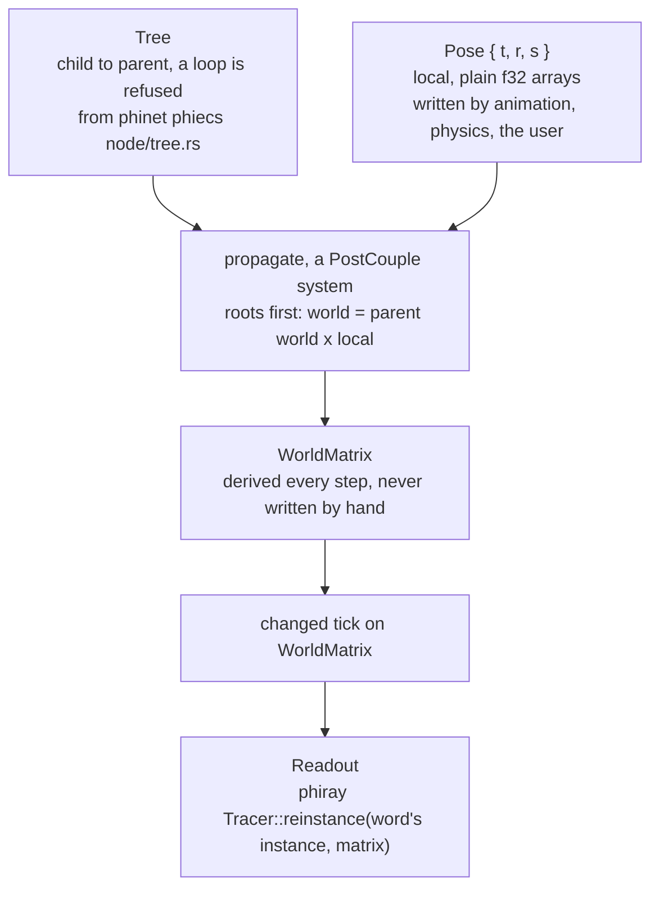
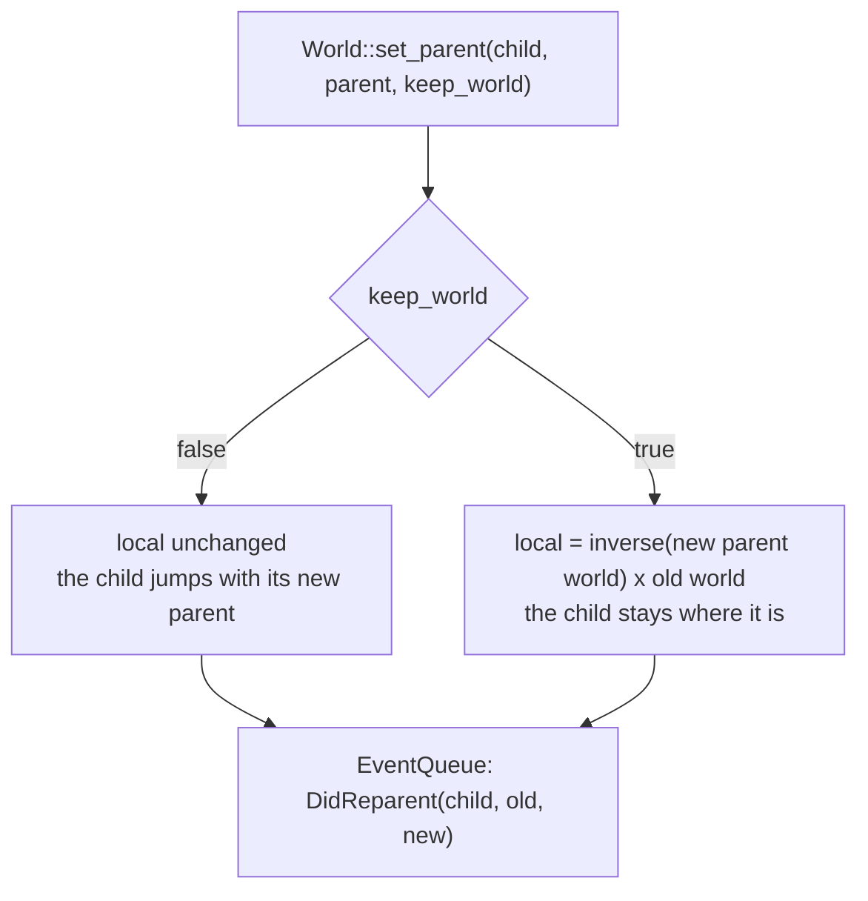
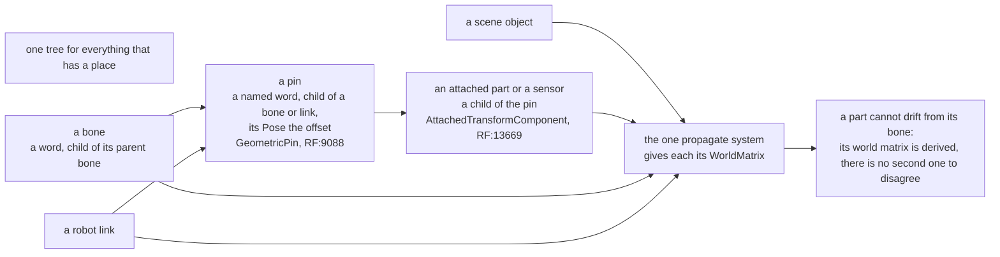

# space

Every box on this page is to build. Today each consumer keeps its own
placement: `BBody` in phiplay, `Placement` in simkit, name pairs in phiphx's
`SceneModel.parents`.

```mermaid
graph TB
    t_tree["Tree<br/>child to parent, a loop is refused<br/>from phinet phiecs node/tree.rs"]
    t_pose["Pose { t, r, s }<br/>local, plain f32 arrays<br/>written by animation, physics, the user"]
    t_prop["propagate, a PostCouple system<br/>roots first: world = parent world x local"]
    t_world["WorldMatrix<br/>derived every step, never written by hand"]
    t_change["changed tick on WorldMatrix"]
    t_out["Readout<br/>phiray Tracer::reinstance(word's instance, matrix)"]
    t_tree --> t_prop
    t_pose --> t_prop
    t_prop --> t_world --> t_change --> t_out
```

```mermaid
graph TB
    r_call["World::set_parent(child, parent, keep_world)"]
    r_keep{"keep_world"}
    r_same["local unchanged<br/>the child jumps with its new parent"]
    r_solve["local = inverse(new parent world) x old world<br/>the child stays where it is"]
    r_event["EventQueue: DidReparent(child, old, new)"]
    r_call --> r_keep
    r_keep -->|false| r_same
    r_keep -->|true| r_solve
    r_same --> r_event
    r_solve --> r_event
```

```mermaid
graph LR
    key["one tree for everything that has a place"]
    p_obj["a scene object"]
    p_bone["a bone<br/>a word, child of its parent bone"]
    p_link["a robot link"]
    p_pin["a pin<br/>a named word, child of a bone or link,<br/>its Pose the offset<br/>GeometricPin, RF:9088"]
    p_part["an attached part or a sensor<br/>a child of the pin<br/>AttachedTransformComponent, RF:13669"]
    p_prop["the one propagate system<br/>gives each its WorldMatrix"]
    p_nogap["a part cannot drift from its bone:<br/>its world matrix is derived, there is no second one to disagree"]
    p_obj --> p_prop
    p_bone --> p_pin --> p_part --> p_prop
    p_link --> p_pin
    p_bone --> p_prop
    p_link --> p_prop
    p_prop --> p_nogap
```
