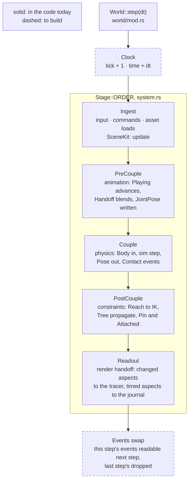
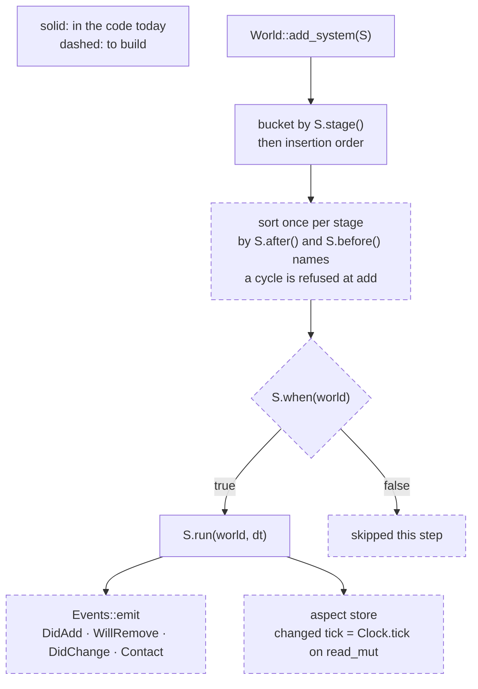
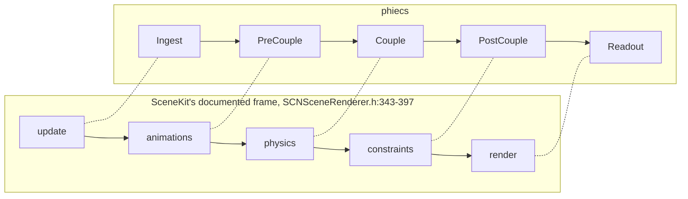

# step

```mermaid
graph TB
    key["solid: in the code today<br/>dashed: to build"]
    s_step["World::step(dt)<br/>world/mod.rs"]
    s_clock["Clock<br/>tick + 1 · time + dt"]
    subgraph stages["Stage::ORDER, system.rs"]
        s_ingest["Ingest<br/>input · commands · asset loads<br/>SceneKit: update"]
        s_pre["PreCouple<br/>animation: Playing advances,<br/>Handoff blends, JointPose written"]
        s_couple["Couple<br/>physics: Body in, sim step,<br/>Pose out, Contact events"]
        s_post["PostCouple<br/>constraints: Reach to IK,<br/>Tree propagate, Pin and Attached"]
        s_readout["Readout<br/>render handoff: changed aspects<br/>to the tracer, timed aspects to the journal"]
    end
    s_swap["Events swap<br/>this step's events readable next step,<br/>last step's dropped"]
    s_step --> s_clock --> s_ingest --> s_pre --> s_couple --> s_post --> s_readout --> s_swap
    classDef plan stroke-dasharray: 6 4;
    class s_clock,s_swap plan;
```

```mermaid
graph TB
    key["solid: in the code today<br/>dashed: to build"]
    o_add["World::add_system(S)"]
    o_bucket["bucket by S.stage()<br/>then insertion order"]
    o_sort["sort once per stage<br/>by S.after() and S.before() names<br/>a cycle is refused at add"]
    o_gate{"S.when(world)"}
    o_run["S.run(world, dt)"]
    o_skip["skipped this step"]
    o_emit["Events::emit<br/>DidAdd · WillRemove · DidChange · Contact"]
    o_tick["aspect store<br/>changed tick = Clock.tick on read_mut"]
    o_add --> o_bucket --> o_sort --> o_gate
    o_gate -->|true| o_run
    o_gate -->|false| o_skip
    o_run --> o_emit
    o_run --> o_tick
    classDef plan stroke-dasharray: 6 4;
    class o_sort,o_gate,o_skip,o_emit,o_tick plan;
```

```mermaid
graph LR
    subgraph scenekit["SceneKit's documented frame, SCNSceneRenderer.h:343-397"]
        k_update["update"] --> k_anim["animations"] --> k_phys["physics"] --> k_cons["constraints"] --> k_render["render"]
    end
    subgraph ours["phiecs"]
        p_ingest["Ingest"] --> p_pre["PreCouple"] --> p_couple["Couple"] --> p_post["PostCouple"] --> p_readout["Readout"]
    end
    k_update -.- p_ingest
    k_anim -.- p_pre
    k_phys -.- p_couple
    k_cons -.- p_post
    k_render -.- p_readout
```
