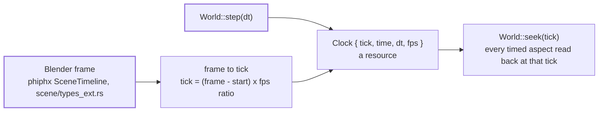
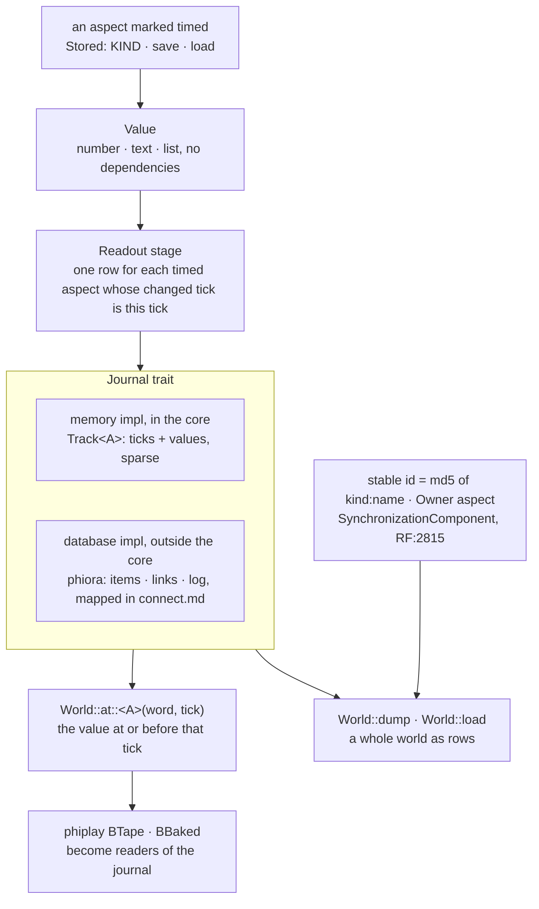
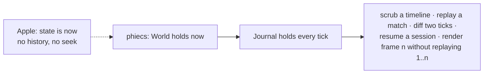

# time

Every box on this page is to build, except `World::step(dt)`, phiphx's
`SceneTimeline`, phiplay's tapes and phiora's tables.

```mermaid
graph LR
    c_step["World::step(dt)"]
    c_clock["Clock { tick, time, dt, fps }<br/>a resource"]
    c_blender["Blender frame<br/>phiphx SceneTimeline, scene/types_ext.rs"]
    c_map["frame to tick<br/>tick = (frame - start) x fps ratio"]
    c_seek["World::seek(tick)<br/>every timed aspect read back at that tick"]
    c_step --> c_clock
    c_blender --> c_map --> c_clock
    c_clock --> c_seek
    classDef have stroke-width: 2px;
    class c_step,c_blender have;
```

```mermaid
graph TB
    j_aspect["an aspect marked timed<br/>Stored: KIND · save · load"]
    j_value["Value<br/>number · text · list, no dependencies"]
    j_readout["Readout stage<br/>one row for each timed aspect whose changed tick is this tick"]
    subgraph journal["Journal trait"]
        j_mem["memory impl, in the core<br/>Track&lt;A&gt;: ticks + values, sparse"]
        j_db["database impl, outside the core<br/>phiora: items · links · log, mapped in connect.md"]
    end
    j_at["World::at::&lt;A&gt;(word, tick)<br/>the value at or before that tick"]
    j_dump["World::dump · World::load<br/>a whole world as rows"]
    j_id["stable id = md5 of kind:name · Owner aspect<br/>SynchronizationComponent, RF:2815"]
    j_tapes["phiplay BTape · BBaked<br/>become readers of the journal"]
    j_aspect --> j_value --> j_readout --> journal
    journal --> j_at
    journal --> j_dump
    j_id --> j_dump
    j_at --> j_tapes
```

```mermaid
graph LR
    a_now["Apple: state is now<br/>no history, no seek"]
    o_now["phiecs: World holds now"]
    o_then["Journal holds every tick"]
    o_use["scrub a timeline · replay a match · diff two ticks ·<br/>resume a session · render frame n without replaying 1..n"]
    a_now -.-> o_now
    o_now --> o_then --> o_use
```
