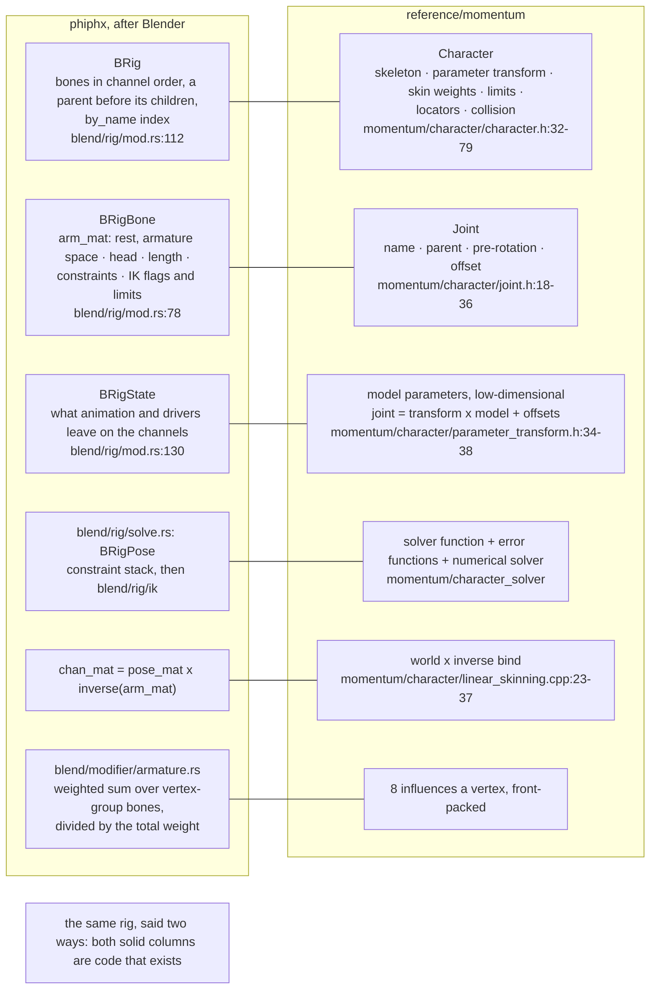
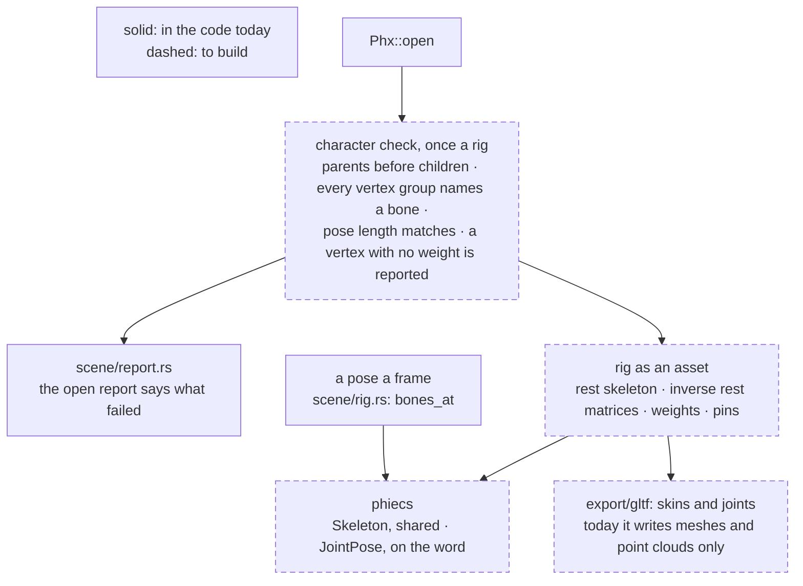
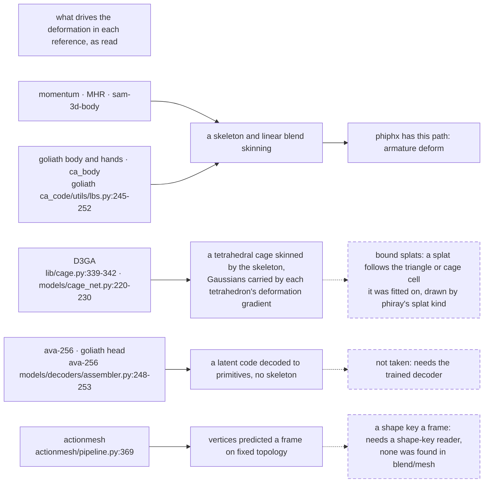
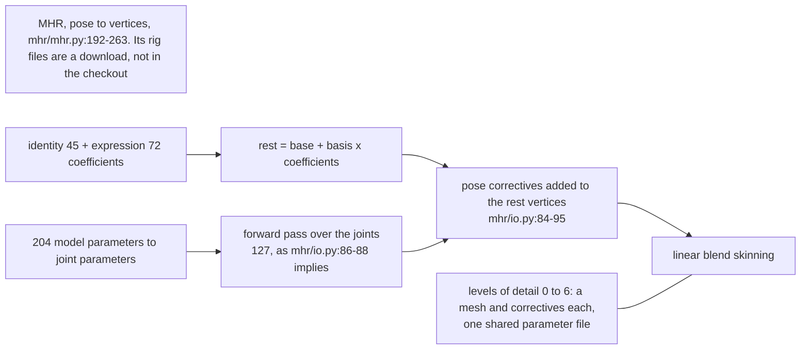

# character

```mermaid
graph LR
    key["the same rig, said two ways: both solid columns are code that exists"]
    subgraph blender["phiphx, after Blender"]
        b_rig["BRig<br/>bones in channel order, a parent before its children,<br/>by_name index<br/>blend/rig/mod.rs:112"]
        b_bone["BRigBone<br/>arm_mat: rest, armature space · head · length ·<br/>constraints · IK flags and limits<br/>blend/rig/mod.rs:78"]
        b_state["BRigState<br/>what animation and drivers leave on the channels<br/>blend/rig/mod.rs:130"]
        b_solve["blend/rig/solve.rs: BRigPose<br/>constraint stack, then blend/rig/ik"]
        b_chan["chan_mat = pose_mat x inverse(arm_mat)"]
        b_deform["blend/modifier/armature.rs<br/>weighted sum over vertex-group bones,<br/>divided by the total weight"]
    end
    subgraph momentum["reference/momentum"]
        m_char["Character<br/>skeleton · parameter transform · skin weights · limits ·<br/>locators · collision<br/>momentum/character/character.h:32-79"]
        m_joint["Joint<br/>name · parent · pre-rotation · offset<br/>momentum/character/joint.h:18-36"]
        m_params["model parameters, low-dimensional<br/>joint = transform x model + offsets<br/>momentum/character/parameter_transform.h:34-38"]
        m_solver["solver function + error functions + numerical solver<br/>momentum/character_solver"]
        m_skinm["world x inverse bind<br/>momentum/character/linear_skinning.cpp:23-37"]
        m_lbs["8 influences a vertex, front-packed"]
    end
    b_rig --- m_char
    b_bone --- m_joint
    b_state --- m_params
    b_solve --- m_solver
    b_chan --- m_skinm
    b_deform --- m_lbs
```

```mermaid
graph TB
    key["solid: in the code today<br/>dashed: to build"]
    c_open["Phx::open"]
    c_check["character check, once a rig<br/>parents before children · every vertex group names a bone ·<br/>pose length matches · a vertex with no weight is reported"]
    c_report["scene/report.rs<br/>the open report says what failed"]
    c_asset["rig as an asset<br/>rest skeleton · inverse rest matrices · weights · pins"]
    c_pose["a pose a frame<br/>scene/rig.rs: bones_at"]
    c_ecs["phiecs<br/>Skeleton, shared · JointPose, on the word"]
    c_gltf["export/gltf: skins and joints<br/>today it writes meshes and point clouds only"]
    c_open --> c_check --> c_report
    c_check --> c_asset --> c_ecs
    c_pose --> c_ecs
    c_asset --> c_gltf
    classDef plan stroke-dasharray: 6 4;
    class c_check,c_asset,c_ecs,c_gltf plan;
```

```mermaid
graph LR
    key["what drives the deformation in each reference, as read"]
    d_lbs["a skeleton and linear blend skinning"]
    d_cage["a tetrahedral cage skinned by the skeleton,<br/>Gaussians carried by each tetrahedron's deformation gradient"]
    d_latent["a latent code decoded to primitives, no skeleton"]
    d_verts["vertices predicted a frame on fixed topology"]
    r_mom["momentum · MHR · sam-3d-body"] --> d_lbs
    r_gol["goliath body and hands · ca_body<br/>goliath ca_code/utils/lbs.py:245-252"] --> d_lbs
    r_d3ga["D3GA<br/>lib/cage.py:339-342 · models/cage_net.py:220-230"] --> d_cage
    r_ava["ava-256 · goliath head<br/>ava-256 models/decoders/assembler.py:248-253"] --> d_latent
    r_act["actionmesh<br/>actionmesh/pipeline.py:369"] --> d_verts
    d_lbs --> t_have["phiphx has this path: armature deform"]
    d_cage -.-> t_bound["bound splats: a splat follows the triangle or cage cell<br/>it was fitted on, drawn by phiray's splat kind"]
    d_latent -.-> t_no["not taken: needs the trained decoder"]
    d_verts -.-> t_shape["a shape key a frame: needs a shape-key reader,<br/>none was found in blend/mesh"]
    classDef plan stroke-dasharray: 6 4;
    class t_bound,t_no,t_shape plan;
```

```mermaid
graph LR
    key["MHR, pose to vertices, mhr/mhr.py:192-263. Its rig files are a download, not in the checkout"]
    h1["identity 45 + expression 72 coefficients"]
    h2["rest = base + basis x coefficients"]
    h3["204 model parameters to joint parameters"]
    h4["forward pass over the joints<br/>127, as mhr/io.py:86-88 implies"]
    h5["pose correctives added to the rest vertices<br/>mhr/io.py:84-95"]
    h6["linear blend skinning"]
    h7["levels of detail 0 to 6: a mesh and correctives each,<br/>one shared parameter file"]
    h1 --> h2 --> h5
    h3 --> h4 --> h5 --> h6
    h7 --- h6
```
